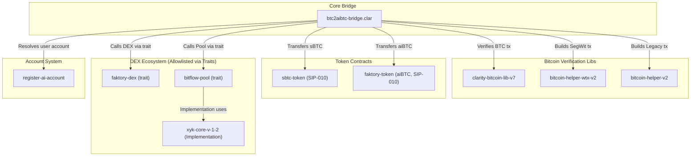

# Phase 3 Analysis: Contract Relationship Diagram

This document provides a visual representation of the `btc2aibtc-bridge` contract and its external dependencies using Mermaid.js.

```mermaid
graph TD
    subgraph "Core Bridge"
        A[btc2aibtc-bridge.clar]
    end

    subgraph "Bitcoin Verification Libs"
        B[clarity-bitcoin-lib-v7]
        C[bitcoin-helper-wtx-v2]
        D[bitcoin-helper-v2]
    end

    subgraph "Token Contracts"
        E["sbtc-token (SIP-010)"]
        F["faktory-token (aiBTC, SIP-010)"]
    end

    subgraph "DEX Ecosystem (Allowlisted via Traits)"
        G["faktory-dex (trait)"]
        H["bitflow-pool (trait)"]
        I["xyk-core-v-1-2 (Implementation)"]
    end

    subgraph "Account System"
        J[register-ai-account]
    end

    A -- "Verifies BTC tx" --> B
    A -- "Builds SegWit tx" --> C
    A -- "Builds Legacy tx" --> D
    A -- "Transfers sBTC" --> E
    A -- "Transfers aiBTC" --> F
    A -- "Calls DEX via trait" --> G
    A -- "Calls Pool via trait" --> H
    H -- "Implementation uses" --> I
    A -- "Resolves user account" --> J
```
